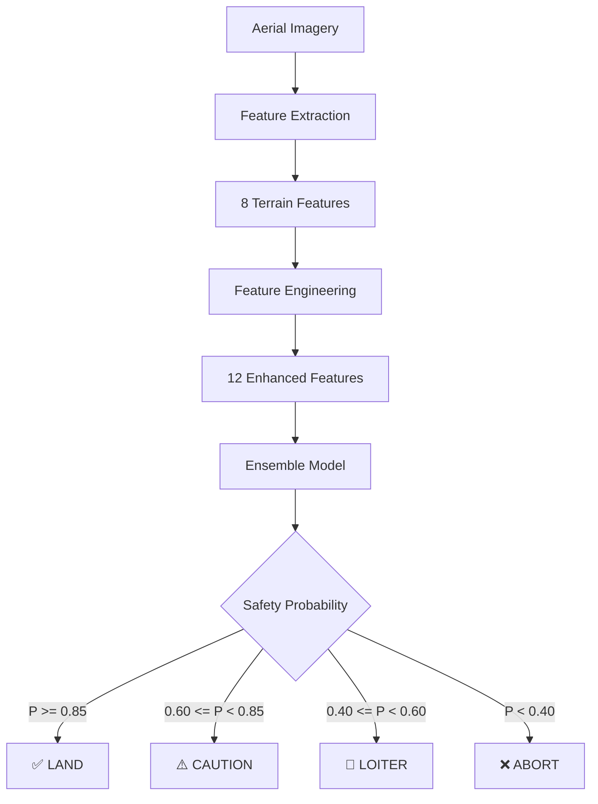

# 🏗️ Architecture

## System Overview



## Pipeline Components

### 1. Data Ingestion
```
Landing Zone Dataset.xlsx
    ↓
pandas.read_excel()
    ↓
Data Cleaning (numeric coercion, dropna)
    ↓
3,000 clean samples
```

### 2. Feature Engineering

| Original (8) | Engineered (4) |
|--------------|----------------|
| slope_deg | slope_roughness = slope × roughness |
| roughness | terrain_complexity = edge × object |
| edge_density | safety_index = confidence / (slope + 1) |
| ndvi_mean | vegetation_shadow = ndvi × shadow |
| shadow_fraction | |
| brightness_std | |
| object_density | |
| confidence_score | |

### 3. Model Architecture

```
┌─────────────────────────────────────────┐
│           VOTING ENSEMBLE               │
│         (Soft Voting)                   │
├─────────────────────────────────────────┤
│  ┌───────────┐  ┌───────────┐  ┌─────┐ │
│  │  Tuned    │  │ Stacking  │  │ RF  │ │
│  │  XGBoost  │  │ Ensemble  │  │     │ │
│  └─────┬─────┘  └─────┬─────┘  └──┬──┘ │
│        │              │            │    │
│        └──────────┬───┴────────────┘    │
│                   ↓                     │
│           Average Probabilities         │
└─────────────────────────────────────────┘
```

**Stacking Ensemble Internal:**
```
Base Estimators:
├── Random Forest (n=150, depth=10)
├── XGBoost (n=150, depth=7, lr=0.1)
└── Gradient Boosting (n=150, depth=5)
        ↓
Meta-Learner: Logistic Regression
```

### 4. Training Pipeline


### 5. Evaluation Metrics

```
                    Predicted
                 Unsafe    Safe
              ┌─────────┬─────────┐
Actual Unsafe │   TN    │   FP*   │ ← Minimize FP (crashes)
              ├─────────┼─────────┤
Actual Safe   │   FN    │   TP    │
              └─────────┴─────────┘

* False Positive = DANGEROUS (Unsafe called Safe)
```

## Data Flow

```
1. Input: [slope, roughness, edge, ndvi, shadow, brightness, object, confidence]
                                    ↓
2. Feature Engineering: + [slope_roughness, terrain_complexity, safety_index, vegetation_shadow]
                                    ↓
3. Model Prediction: VotingClassifier.predict_proba()
                                    ↓
4. Output: Safety Probability [0.0 - 1.0]
                                    ↓
5. Decision: Apply threshold logic → [LAND, CAUTION, LOITER, ABORT]
```

## Spatial Analysis

```
         Roughness
    0.0           1.0
    ┌───────────────┐ 0°
    │ 🟢 SAFE       │
    │               │
    │    🟡        │
  S │    CAUTION   │
  l │               │
  o │        🔴    │
  p │     RESTRICT │
  e │               │
    └───────────────┘ 45°
```

## Technology Stack

| Component | Technology |
|-----------|------------|
| Language | Python 3.8+ |
| ML Framework | scikit-learn, XGBoost |
| Data Processing | pandas, numpy |
| Visualization | matplotlib, seaborn |
| Interpretability | SHAP |
| Oversampling | imbalanced-learn (SMOTE) |
| Notebook | Jupyter |

## Performance Benchmarks

| Model | ROC-AUC | Training Time |
|-------|---------|---------------|
| Random Forest | ~0.95 | ~5s |
| XGBoost | ~0.96 | ~8s |
| Stacking | ~0.97 | ~45s |
| Voting (Final) | ~0.97 | ~60s |
