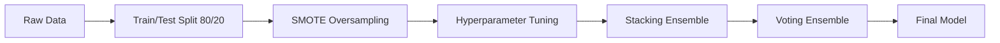

# 🏗️ Architecture

## System Overview

```mermaid
flowchart TD
    A[Aerial Imagery] --> B[Feature Extraction]
    B --> C[8 Terrain Features]
    C --> D[Feature Engineering]
    D --> E[12 Enhanced Features]
    E --> F[Ensemble Model]
    F --> G{Decision Logic}
    G -->|Prob >= 0.85 & Conf >= 0.70| H[✅ LAND]
    G -->|Prob >= 0.60| I[⚠️ CAUTION]
    G -->|Prob >= 0.40| J[🔄 LOITER]
    G -->|Else| K[❌ ABORT]
```



## Pipeline Components

### 1. Data Ingestion
```
Landing Zone Dataset.xlsx
    ↓
pandas.read_excel()
    ↓
Data Cleaning (numeric coercion, dropna)
    ↓
3,000 clean samples
```

### 2. Feature Engineering

| Original (8) | Engineered (4) |
|--------------|----------------|
| slope_deg | slope_roughness = slope × roughness |
| roughness | terrain_complexity = edge × object |
| edge_density | safety_index = confidence / (slope + 1) |
| ndvi_mean | vegetation_shadow = ndvi × shadow |
| shadow_fraction | |
| brightness_std | |
| object_density | |
| confidence_score | |

### 3. Model Architecture

```
┌─────────────────────────────────────────┐
│           VOTING ENSEMBLE               │
│         (Soft Voting)                   │
├─────────────────────────────────────────┤
│  ┌───────────┐  ┌───────────┐  ┌─────┐ │
│  │  Tuned    │  │ Stacking  │  │ RF  │ │
│  │  XGBoost  │  │ Ensemble  │  │     │ │
│  └─────┬─────┘  └─────┬─────┘  └──┬──┘ │
### 3. Model Architecture & Optimization
The system uses a **Safety-First Multi-Model Evaluation Pipeline**:
1. **Candidate Suite**: 11 diverse models (Standard Ensembles, Boosted Trees, SVM, KNN, MLP).
2. **Resampling**: SMOTE is applied to balance safety labels.
3. **Safety Optimization**: For each model, the probability threshold is dynamically scanned (0.5 to 0.95) to find the point where **False Positives (Fatal Errors) are minimized to zero**.
4. **Tie-Breaking**: If multiple models achieve zero fatal errors, the model with the fewest False Negatives (Missed Landings) is prioritized.

### 4. Evaluation Metrics
- **Strict Precision**: Primary metric. Classification of an unsafe zone as safe (False Positive) is considered a "Fatal Error."
- **Safety Recall**: Identifies the percentage of safe zones successfully detected.
- **Decision Threshold (t)**: Optimized per model to guarantee safety ($Precision \rightarrow 1.0$).

### 4. Training Pipeline



### 5. Evaluation Metrics

```
                    Predicted
                 Unsafe    Safe
              ┌─────────┬─────────┐
Actual Unsafe │   TN    │   FP*   │ ← Minimize FP (crashes)
              ├─────────┼─────────┤
Actual Safe   │   FN    │   TP    │
              └─────────┴─────────┘

* False Positive = DANGEROUS (Unsafe called Safe)
```

## Data Flow

```
1. Input: [slope, roughness, edge, ndvi, shadow, brightness, object, confidence]
                                    ↓
2. Feature Engineering: + [slope_roughness, terrain_complexity, safety_index, vegetation_shadow]
                                    ↓
3. Model Prediction: VotingClassifier.predict_proba()
                                    ↓
4. Output: Safety Probability [0.0 - 1.0]
                                    ↓
5. Decision: Apply threshold logic → [LAND, CAUTION, LOITER, ABORT]
```

## Spatial Analysis

```
         Roughness
    0.0           1.0
    ┌───────────────┐ 0°
    │ 🟢 SAFE       │
    │               │
    │    🟡        │
  S │    CAUTION   │
  l │               │
  o │        🔴    │
  p │     RESTRICT │
  e │               │
    └───────────────┘ 45°
```

## Technology Stack

| Component | Technology |
|-----------|------------|
| Language | Python 3.8+ |
| ML Framework | scikit-learn, XGBoost |
| Data Processing | pandas, numpy |
| Visualization | matplotlib, seaborn |
| Interpretability | SHAP |
| Oversampling | imbalanced-learn (SMOTE) |
| Notebook | Jupyter |

## Performance Benchmarks

| Model | ROC-AUC | Training Time |
|-------|---------|---------------|
| Random Forest | ~0.95 | ~5s |
| XGBoost | ~0.96 | ~8s |
| Stacking | ~0.97 | ~45s |
| Voting (Final) | ~0.97 | ~60s |
